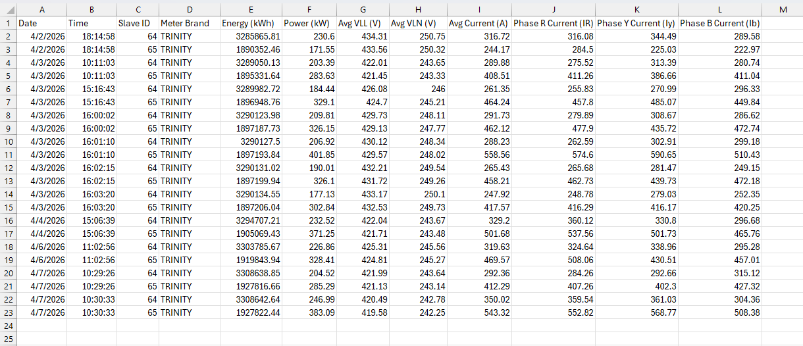
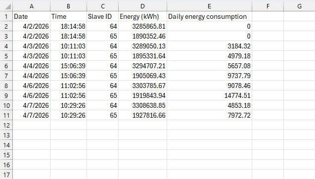

# Industrial Modbus TCP Data Logger⚡

An automated, multi-threaded Python data logging system designed to monitor factory energy consumption across multiple network gateways. 

This script communicates directly with industrial energy meters (Trinity, Schneider, Rishabh) using the Modbus TCP protocol, extracts live power data, and logs it cleanly into organized CSV files.

 🚀 Key Features

* Multi-Gateway Routing: Seamlessly manages connections across different IP addresses to poll different factory zones simultaneously.
* Smart Device Detection: Automatically pings unassigned Slave IDs to detect the meter brand and applies the correct Modbus register rulebook.
* Intelligent Error Handling: Features a "Blacklist Memory" that temporarily ignores unresponsive meters for 60 seconds, preventing network timeouts from stalling the entire factory scan.
* Automated Daily Math: Detects shift changes (e.g., 8:00 AM) and automatically calculates the total 24-hour kWh consumption by comparing live data against historical memory.
* Safe Disk I/O: Buffers data in memory and writes to CSVs in clean blocks to minimize hard drive wear and handle Excel "File Open" permission locks gracefully.

# Sample Output
The system generates clean, row-based CSV files perfect for Excel filtering and Pivot Tables.

# Technology Stack
* Language: Python 3.14.3
* Core Libraries: `socket`, `struct` (for hexadecimal/byte translation), `csv`, `os`, `datetime`
* Protocol: Modbus TCP/IP

# How to Use
1. Ensure your machine has network access to the Modbus Ethernet gateways.
2. Configure your target IPs and Slave ID ranges in the `GENERATING_UNITS` dictionary.
3. Run `python master_logger.py`. The system will run infinitely until manually terminated.
